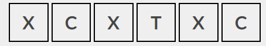
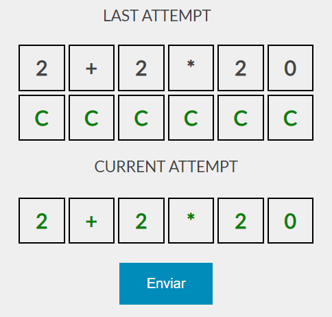

<h1 align="center">DontPanic Baby 42 São Paulo 💻</h1>

<h2 align="center">Descrição do projeto</h2>

O jogo consiste em adivinhar a equação escondida da qual sempre resulta em `42`. Cada tentativa deve resultar no numero `42`, e a cada tentativa valida, uma dica será exibida ao jogador.

Por baixo dos panos, ao enviar uma tentativa, consultamos uma API que irá verificar se o calculo está correto ou não, devolvendo uma resposta adequada ao jogador.


## 📁 Acesso ao projeto
A fim de subir a aplicação e jogar o jogo, clone o repositório em sua máquina:
```bash
git clone https://github.com/42sp/42labs-dontpanic_baby-21875133.git dont_panic_baby
```
Mova para o diretorio da aplicação:
```bash
cd dont_panic_baby
```

Para subir o servidor local, basta executar o utilitário `make`, ou utilizar o comando `go` para isso:
```bash
make
# [GIN-debug] Listening and serving HTTP on labs-bexs-u8968B-Y.42sp.org.br:5011

# ou
go run server.go

# [GIN-debug] Listening and serving HTTP on labs-bexs-u8968B-Y.42sp.org.br:5011
```
O servidor irá escutar na porta `5011` providenciada pela 42sp.
Uma vez que o servidor esteja em execução, para acessar o jogo, basta acessarmos a URL na respectiva porta:
```
http://labs-bexs-u8968b-y.42sp.org.br:5011
```


## 🛠️ Tecnologias utilizadas
- **Linguagens**: Golang, JavaScript;
- **Bibliotecas**: gin-gonic, gin-gonic-cors;
- **Tecnologias**: HTML, CSS;
- **Ferramentas**: Make, VS Code.


## 🧪 Testes unitários
A aplicação vem com um conjunto extenso de testes unitários referentes a lógica do jogo. Um `makefile` é disponibilizado para subir o servidor, e também para executar todos testes unitários.

Para isso, basta executar o seguinte comando no diretorio raiz do projeto:

```bash
make test
```

---
## Como jogar
Existe uma equação que resultara no valor `42`, como no exemplo abaixo:


No entanto, essa equação, embora resultando no valor `42`, ela nao é a nossa solução. Por conta disso o jogo exibe algumas dicas para que o jogador possa pensar em outra potencial solução:



Onde:

__`X`__: Indica que o digito/operador não faz parte da equação escondida;

__`T`__: Indica que o digito/operador faz parte da equação escondida, no entanto, não está exatamente naquela posição em específico;

__`C`__: Indica que o digito/operador faz parte da equação escondida, e está na posição correta.


Com essas informações o jogador pode tentar outras soluções até que eventualmente chegue a solução correta:




## Regras
Tenha em mente que existe ordem de precedência nas operações. Por exemplo, multiplicação e divisão serão perfomadas antes de adição e subtração.

Qualquer entrada invalida será devidamente invalidada, não gerando quaisquer dicas, apenas um aviso sobre o respectivo erro.

Propriedade comutativa __não__ é aplicada! Ou seja, `2+3 != 3+2`. A aplicação irá considerar a ordem dos operandos com base na solução providenciada pela API.


---

## Desenvolvedores

<div align="left">
<a href="https://github.com/Warley-Juneo"  target="_blank"></a>
<a href="https://github.com/maykonmori"  target="_blank"></a>
<a href="https://github.com/ichmi"  target="_blank"></a>

[<sub> Warley Juneo </sub>](https://github.com/Warley-Juneo)&nbsp;&nbsp;&nbsp;&nbsp;&nbsp;&nbsp;&nbsp;&nbsp;&nbsp;[<sub> Maykon Mori </sub>](https://github.com/maykonmori)&nbsp;&nbsp;&nbsp;&nbsp;&nbsp;&nbsp;&nbsp;&nbsp;&nbsp;&nbsp;[<sub>frosa-ma | Fábio</sub>](https://github.com/ichmi)

</div>


